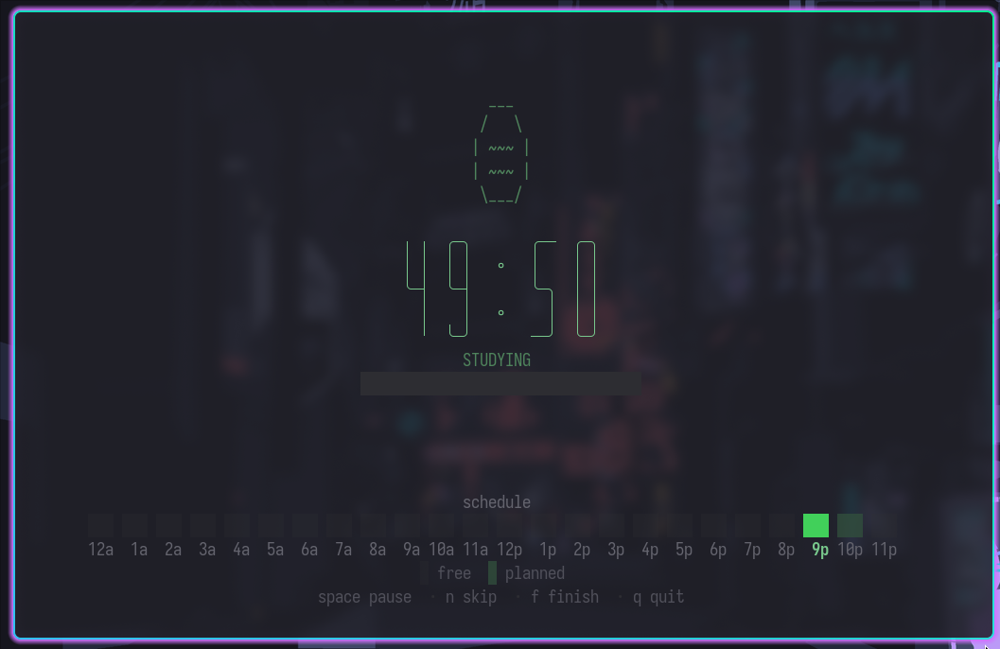

# Pomoru 🍅

A minimal TUI Pomodoro timer with a visual 24-hour schedule, built in Rust.

Plan your study blocks, track your focus sessions, and stay productive — all from the terminal.



## Features

- Large ASCII countdown timer with progress bar
- 24-hour schedule bar — plan, visualize, and track your day
- Built-in presets: `deep` (50/10), `classic` (25/5), `short` (15/3)
- Fully customizable study and break durations
- Session history and stats (`pomoru stats`)
- Configurable color theme via `~/.config/pomoru/config.toml`
- Desktop notifications when sessions end
- Zero async — lightweight and fast

## Installation

### From source (requires [Rust](https://www.rust-lang.org/tools/install))

```bash
git clone https://github.com/Natzgun/pomoru.git
cd pomoru
cargo install --path .
```

### Build only

```bash
cargo build --release
# Binary will be at target/release/pomoru
```

## Usage

```bash
# Default: 50 min study, 10 min break
pomoru

# Custom durations
pomoru --study 25 --break 5

# Use a preset
pomoru --preset classic   # 25/5
pomoru --preset deep      # 50/10
pomoru --preset short     # 15/3

# View your stats
pomoru stats
```

### Keybindings

#### Setup mode

| Key | Action |
|---|---|
| `Left` / `Right` | Move cursor on schedule |
| `Space` | Toggle block planned/unplanned |
| `H` / `L` | Select range of blocks |
| `c` | Clear all planned blocks |
| `Up` / `Down` | Adjust duration |
| `Tab` | Switch between study/break field |
| `Enter` | Start session |
| `q` | Quit |

#### Active mode

| Key | Action |
|---|---|
| `Space` | Pause / Resume |
| `n` | Skip to next phase |
| `f` | Finish session |
| `q` | Quit (with confirmation) |

#### Done

| Key | Action |
|---|---|
| `r` | Start new session |
| `q` | Quit |

## Configuration

Create `~/.config/pomoru/config.toml` to customize the color theme:

```toml
[theme]
study     = [120, 200, 140]   # RGB for study phase
break     = [100, 180, 220]   # RGB for break phase
paused    = [200, 190, 80]    # RGB for paused state
idle      = [140, 140, 150]   # RGB for idle state
planned   = [50, 80, 60]      # RGB for planned blocks
completed = [40, 160, 80]     # RGB for completed blocks
```

## Contributing

Contributions are welcome! Here's how to get started:

1. **Fork** the repository
2. **Clone** your fork:
   ```bash
   git clone git@github.com:<your-username>/pomoru.git
   cd pomoru
   ```
3. **Create a branch** for your feature or fix:
   ```bash
   git checkout -b feat/my-feature
   ```
4. **Make your changes** and ensure everything compiles:
   ```bash
   cargo build
   cargo clippy
   ```
5. **Commit** with a clear message:
   ```bash
   git commit -m "feat: add my feature"
   ```
6. **Push** and open a Pull Request against `main`

### Project structure

```
src/
├── main.rs          # CLI parsing, terminal setup, main loop
├── app.rs           # State machine (Idle → Studying → Breaking → Done)
├── timer.rs         # Countdown logic
├── schedule.rs      # 24h block model
├── event.rs         # Terminal event polling
├── theme.rs         # Colors and visual effects
├── config.rs        # User configuration loading
├── history.rs       # Session persistence and stats
├── notify.rs        # Desktop notifications
└── ui/
    ├── mod.rs           # Draw entry point
    ├── layout.rs        # Layout composition
    ├── timer_view.rs    # Timer display + progress gauge
    ├── schedule_bar.rs  # 24h colored block bar
    └── controls.rs      # Context-sensitive key hints
```

### Guidelines

- Keep the codebase minimal — avoid adding unnecessary dependencies
- All rendering is stateless: UI functions take `&App` + `&mut Frame`
- State transitions happen only in `app.rs` via `handle_tick()` and `handle_key()`
- No async runtime — the main loop uses `crossterm::event::poll` with 200ms timeout

## License

[MIT](LICENSE)

---

*This project was built with the assistance of AI (Claude).*
